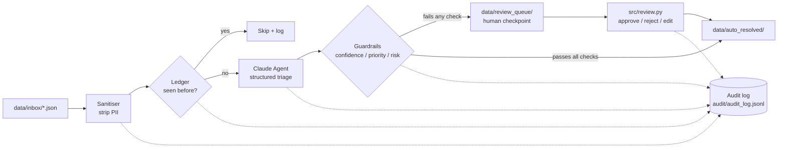

# governed-ai-triage

A governed AI ticket triage pipeline built on interacting with the Claude API. Featuring PII sanitisation, idempotent processing, guardrailed routing, and a
full audit trail, it's built as a proof-of-concept to demonstrate how I'd approach putting an LLM into a real operational workflow.

## Architecture



Every box with a dotted line into the audit log writes a JSONL entry. This includes a timestamp, ticket hash, stage, model, token counts and routing decision.

## Quickstart

```bash
git clone https://github.com/harleyoliver/governed-ai-triage.git
cd governed-ai-triage
python3 -m venv .venv && source .venv/bin/activate
pip install -r requirements.txt

# Run with no API key and no network using mocked model responses
python3 src/pipeline.py --mock --reset

# Check the results
ls data/review_queue/       # low-confidence / urgent / risk-flagged items
ls data/auto_resolved/      # everything else
cat audit/audit_log.jsonl   # full trail of every decision made

# Run the human review checkpoint
python3 src/review.py
```

To run against Claude API instead of using mock responses:

```bash
cp .env.example .env        # then add your real ANTHROPIC_API_KEY
python3 src/pipeline.py --reset
```

Run tests and linting:

```bash
pytest -v
ruff check src/ tests/
```

## Why this design

**PII never reaches the model.** `src/sanitiser.py` redacts names, emails, and phone numbers before any API call is made.
[`docs/decisions/0001-sanitise-before-send.md`](docs/decisions/0001-sanitise-before-send.md).

**Nothing is ever double processed.** A SHA-256 content hash is generated for each ticket, then checked against a ledger before any API call.
[`docs/decisions/0002-hash-ledger-idempotency.md`](docs/decisions/0002-hash-ledger-idempotency.md).

**The model never has the final word.** `src/guardrails.py` routes
low-confidence, high-priority, or risk-flagged classifications to a review checkpoint (`src/review.py`). The full policy is in
[`GOVERNANCE.md`](GOVERNANCE.md). Thresholds are in `config.yaml` so that policy is reviewable by a non-engineer.

**CI runs without secrets.** `.github/workflows/ci.yml` uses `--mock` mode exclusively so no API keys get stored in the repo's Actions config. [`docs/decisions/0003-mock-mode-in-ci.md`](docs/decisions/0003-mock-mode-in-ci.md).

**Everything is auditable.** Every stage of every ticket writes an entry to `audit/audit_log.jsonl`. This includes sanitisation, ledger checks, model calls with token counts, routing decisions, and review outcomes.

## Project structure

governed-ai-triage/
├── data/inbox/ synthetic helpdesk tickets (input)
├── data/review_queue/ tickets awaiting review (output)
├── data/auto_resolved/ tickets that passed all guardrails (output)
├── src/
│ ├── sanitiser.py PII redaction
│ ├── ledger.py content-hash ledger
│ ├── agent.py Claude API call + mock agent
│ ├── guardrails.py routing policy
│ ├── audit.py audit logging
│ ├── pipeline.py orchestrator
│ └── review.py review CLI
├── prompts/triage_v1.md versioned system prompt
├── config.yaml thresholds and routing policy
├── tests/ pytest suite
├── docs/decisions/ architecture decision records
├── GOVERNANCE.md data handling & human-in-the-loop policy
└── .github/workflows/ CI (lint + test + mock pipeline run)

## Status

Proof-of-concept. Built to demonstrate governed AI adoption patterns, data sanitisation, guardrailed resolution, human-in-the-loop
review, and a full audit trail. Applicable to any operational workflow being handed to an AI Agent.
